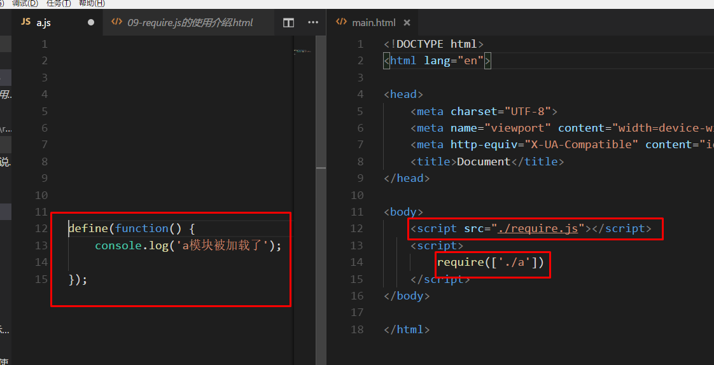

# 前端模块化

## 模块化是什么？

> 将js代码，按照不同的功能拆分。

## 为什么要使用模块化

1. 便于管理
2. 便于复用
3. 便于分工

## 如何实现模块化

### 原始的模块化

- 将js功能拆分成一个个的文件，通过script标签引入
- 存在的问题：
  - 文件之间项目不独立，没有独立作用域。
  - 依赖关系严重，路径混乱。

### 通过插件实现

> 为了统一模块化的使用，市面上如今有三种成熟的，以及一个未来的ES6模块化标准
>
> 1. commonJS，node的模块化标准。
> 2. AMD，国外的标准。思想是一开始就引入所有模块。
> 3. CMD，国内的，思想是引入到一个模块就加一个，增量型。
>
> 这里只介绍AMD，因为国外基本不用CMD，而很多支持模块化的插件都是AMD的

## require.js

> 总体就是两个函数`define`定义模块和`require`加载模块

### 简单使用

- 引入require.js文件
- 在js文件中通过`define`(回调),定义一个模块
- 在`main.html`中通过`require`载入这个模块



#### **怎么接收传参？**

```js
// a.js 定义模块
define(function() {
    console.log('a模块被加载了');
    var num = 10;
    return num;
});

// 在入口文件引入，并且使用回调来接收返回值
require(['./a'], function(num) {
    console.log(num);//10
});
```

#### 模块需要依赖项怎么引入？

- `define([依赖模块名(不要带js)],回调)`
- 通过`$`形参就可以使用`jquery`了

```js
define(['./jquery'], function($) {
    console.log($);
});
```

## 路径查找问题

1. 正常引入的情况下，路径就是按照当前的文件
2. 通过`data-main='入口文件'` ，指定的路径按照`data-main`指定的路径找

```html
// 平常开发中，html和js的代码肯定是分开的，所以不会在html中写个标签来引模块，
//而是写一个入口文件。
//data-main 是require.js提供的属性，可以指定入口文件
<script src="./require.js" data-main="./main.js"></script>
```

3. 使用`require.config()`配置的路径，按照 baseUrl + path 的方式去查找

```js
//a.js
define(['./jquery'], function($) {
    console.log($);
    return 1;
});
//入口文件 main.js
require.config({
    baseUrl: '/',
  //必须在http协议下打开，表示根目录
    paths: {
        "tools": "a",
    }
})
// 使用paths定义的名字引入
require(['tools'], function(num) {
    console.log(num);
})
```

- 当模块写了名字，这里的`path` 名字就必须和模块的名字一致

```js
//a.js
//这里给a模块取了一个tools的名字
define('tools',['./jquery'], function($) {
    console.log($);
    return 1;
});
//入口文件 main.js
require.config({
    baseUrl: '/',
  //必须在http协议下打开，表示根目录
    paths: {
        //"tools": "a", 名字一致，不报错
       		"t":"a",//名字不一致，报错
    }
})

require(['tools'], function(num) {
    console.log(num);
})
```

#### 注意事项

> 当引入的文件如下面三种,不会按照baseUrl+path的方式去找路径

1. 引用模块的路径是以/开头的
2. 文件名带了.js后缀的
3. 模块的路径是以`http` 或者` https`开头

## 加载第三方模块

> 别人写的代码都叫第三方，那么就难免会碰到不用模块化写的插件。
>
> 可是又需要用里面的插件来写项目怎么办？
>
> 1. 插件本身就支持AMD，直接用require加载
> 2. 插件有没有返回值？没有，直接require加载
> 3. 有返回值，比如jquery会返回一个$对象（当然jq支持AMD标准，只是举个例子）。这个情况就要对模块先进行配置，才能愉快的导入

```js
// 引入b模块，b模块里面有一个全局的a变量
require.config({
    baseUrl: '/',
    paths: {
        'jqB': 'b'
      //配置一个b文件的路径
    },
    shim: {
        "jqB": {
            exports: 'obj',
          //绑定b模块里面的全局变量
        }
    }
})

// b.js
var obj = {
    name: 'mmf',
    age: 18,
    say() {
        console.log('111');
    }
}
```

> 4. 有返回值，引入的模块里面又有需要引入的模块怎么办？

```js
// 给shim配置一个dpes参数，指定需要的模块即可
require.config({
    baseUrl: '/',
    paths: {
        'jqC': 'c'
    },
    shim: {
        "jqC": {
          //这里写需要的包名，不要带js
            deps: ['jquery']
        }
    }
})
// c.js
$('body').html('像我这么优秀的人')
```


