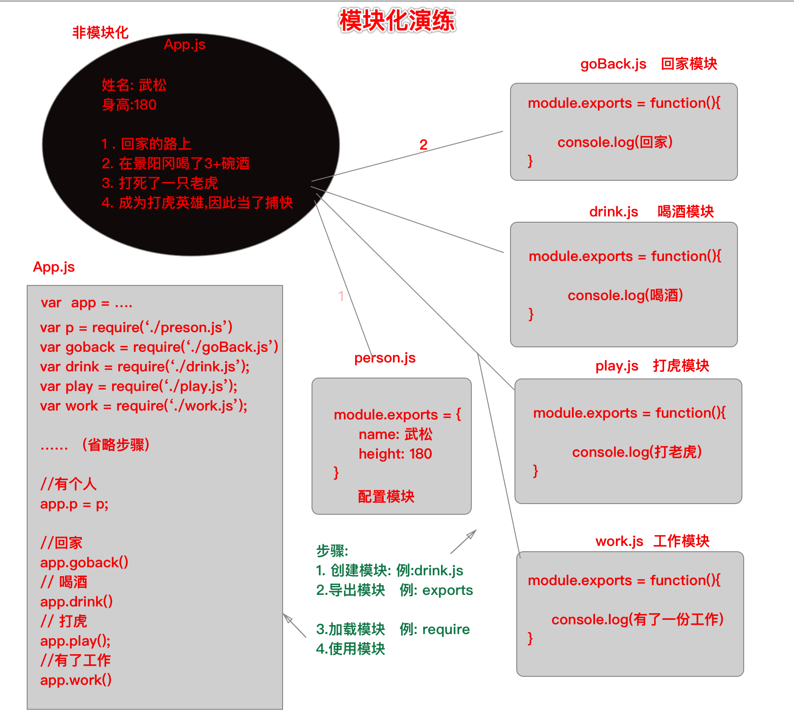

# 模块化开发

1. ##### 什么是模块化开发?

   - 简单的说就是: 我们实现一个应用,通常都会按照不同的功能,分割成不同的模块来编写,编写完之后,按照某种方式组装起来成为一个整体,最终实现整个系统的功能。
   - 再再简单的一句话就是: `把不同的功能,放到不同的模块里(.js)编写`
   - 可以理解为一个个沙箱，以前是通过script标签src引入的.现在可以在js文件中引入。

2. ##### 为什么要进行模块化?

- 便于多人合作开发 ;
- 便于后期代码的维护 ; 

##### 3.  怎么进行模块化?

★ 步骤

> 时刻记住模块化的四个步骤:
>
> 1.创建模块(router.js),
>
>  2.导出模块(module.exports),
>
> 3.加载模块(require),
>
> 4.使用模块

##### ★ 时刻记住如何编写模块:

> 1. 当前模块要写什么内容?      ——>简: 内容
> 2. 这些代码是否用到外部的数据? ——>简: 参数
> 3. 是否依赖第三方模块、内置模块、文件模块和一起自定义方法 ——>简: 模块(函数)

###  